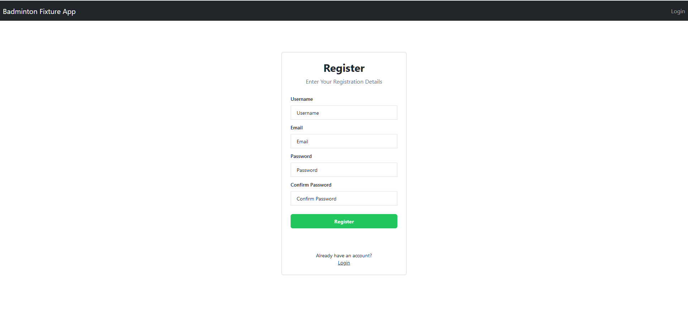
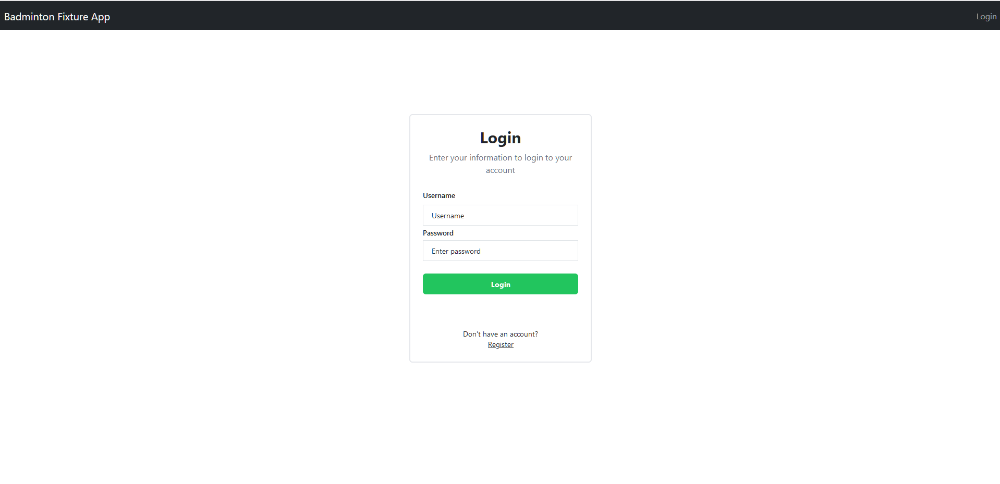
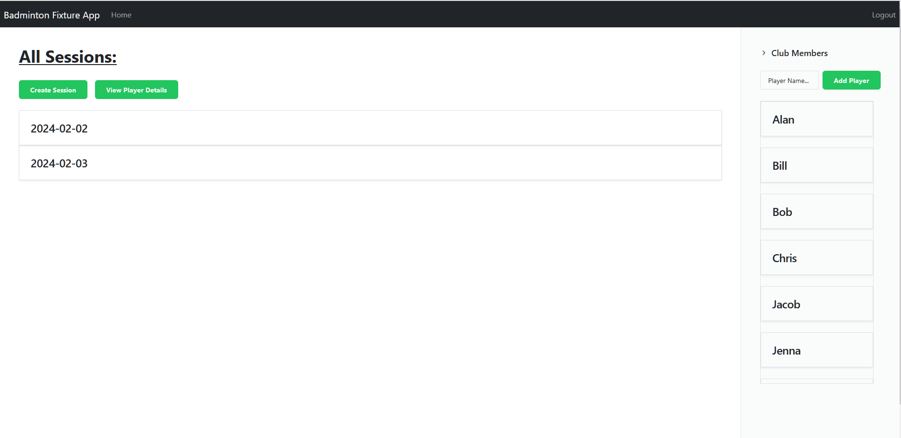
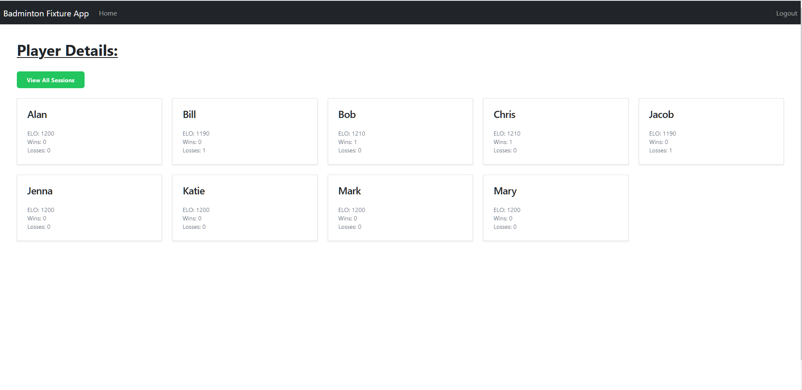
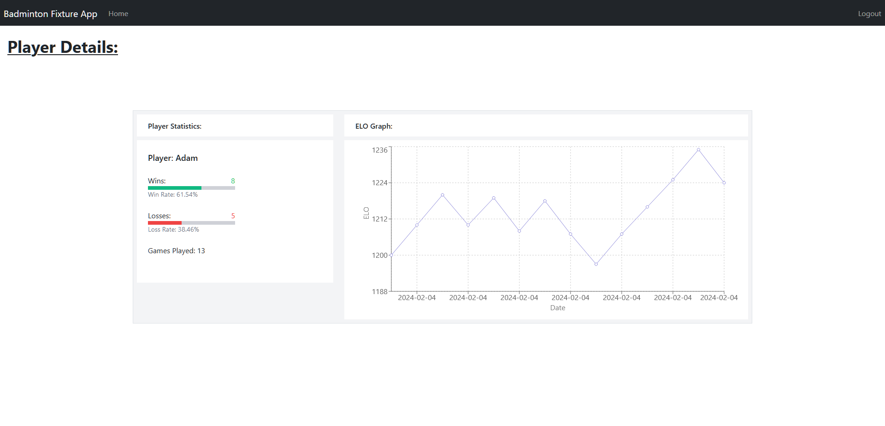

# Badminton Club Organizer App Fullstack - https://badmintonfixtures.netlify.app

## Overview

Welcome to the Badminton Club Organizer App, a specialized tool crafted for club organizers to manage badminton matches within their club. This app focuses on creating fair and competitive match pairings based on players' ratings, and each game played will dynamically influence a player's rating. This ensures that the club maintains a balanced and competitive environment for all its members.

**Stack:**

- Backend: Django (Django REST Framework)
- Frontend: React + Vite, TailwindCSS, shadcn/ui, Recharts

## Features

### 1. Club Management

**Organizer Dashboard:**

- Manage and oversee all club activities from a centralized dashboard.
- Access key statistics and insights about players and match outcomes.

### 2. Match Fixing Algorithm

- **Dynamic Pairings:**
  - Utilize a sophisticated algorithm to create match pairings based on real-time player ratings.
  - Ensure that each game is competitive, promoting player improvement and engagement.

### 3. Match Outcome Tracking

- **Real-time Updates:**
  - Capture and update match results in real-time.
  - Automatically adjust player ratings based on the outcome of each match.

## User Interface

### 1. Registration Page

### 2. Login Page

### 3. Home Page

### 4. Club Page

### 4. Players Page

### 5. Player Statistics Page

### 5. Sessions Page

### 6. Match Page

